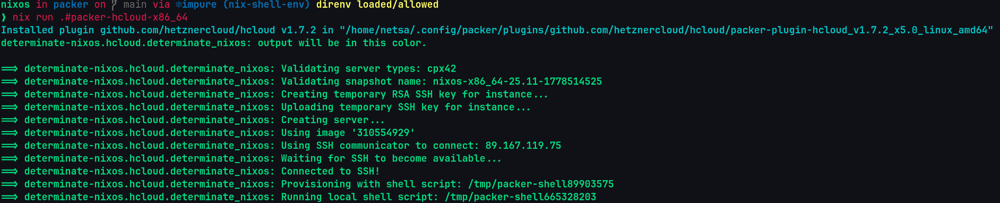
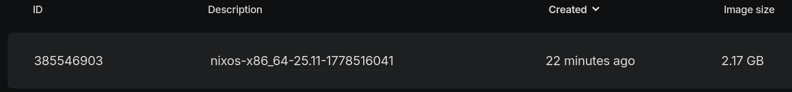
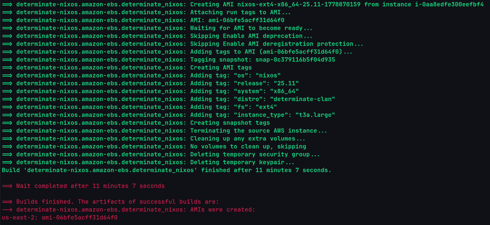
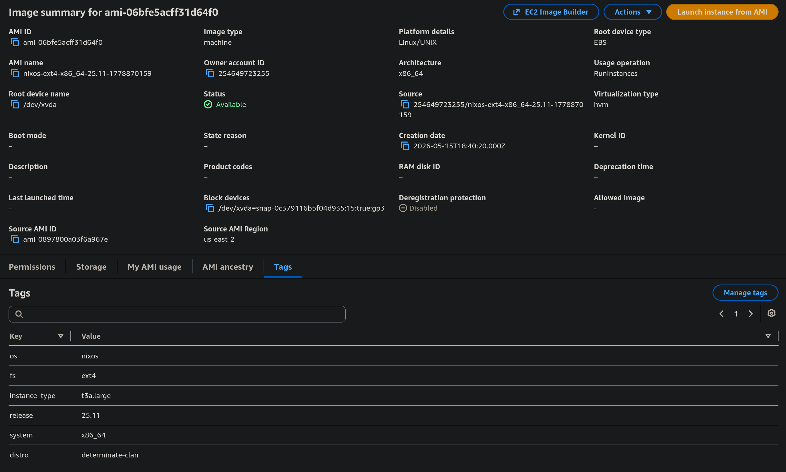

# Minimal NixOS Packer Images and Scripts

<div align="center">
  
</div>

<p align="center">
  <a href="https://github.com/andrewthomaslee/packer/releases"></a>
  <a href="https://github.com/andrewthomaslee/packer/actions/workflows/ci.yml"></a>
  <a href="https://github.com/andrewthomaslee/packer/blob/main/LICENSE"></a>
</p>

<p align="center">
  <a href="https://github.com/andrewthomaslee/packer"></a>
  <a href="https://flakehub.com/flake/andrewthomaslee/packer?view=usage"></a>
</p>


<h3 align="center">
  <strong>Minimal <u>NixOS</u>❄️ built with <u>HashiCorp Packer</u>📦</strong>
</h3>


<div align="center">

## Features

### **Cloud Providers**

`AWS` • `Hetzner Cloud`

### **Included Modules**

`Determinate Systems` • `Clan.lol` • `ZFS` • `Ext4` • `Motd`

</div>

## Usage
### Cloud Credentials
Create a `.env` file without spaces or comments in the root of the project follwing `.env.schema`

### Run
This will create a `Hetzner Cloud` image.
Use the [*FlakeHub*](https://flakehub.com/flake/andrewthomaslee/packer?view=usage) url:
```console
nix run "https://flakehub.com/f/andrewthomaslee/packer/*#packer-hcloud-x86_64"
```
or the [*GitHub*](https://github.com/andrewthomaslee/packer/releases) url:
```console
nix run github:andrewthomaslee/packer#packer-hcloud-x86_64
```
#### Hcloud

In `Hetzner Cloud` you can see the new image:



#### AWS

In `AWS` you can see the new AMI (Amazon Machine Image):


## Project layout

    flake.nix       # Flake that controls the project
    flake.lock      # Flake's lock file
    inventory.nix   # Clan.lol Inventory of all NixOS machines and Services
    .envrc          # direnv configuration
    .env.schema     # Varlock schema

    machines/       # NixOS Machines   
    lib/            # Custom functions accessible via `lib.custom`

    flake-parts/        # Top-level Flake Part files
        default.nix     # Default flake-parts configuration
        devShells.nix   # Development Shells
        apps/           # Applications `nix run .#<app>`
        packages/       # Packages `nix build .#<package>`
        nixosModules/   # NixOS Modules

    documentation/      # MkDocs
        mkdocs.yml      # MkDocs configuration
        docs/           # Documentation source

    .github/workflows/      # GitHub Actions workflows
        ci.yml              # CI workflow for FlakeHub Cache and MkDocs

    sops/                   # Encrypted Secrets
    vars/                   # Clan.lol implementaion of SOPS

## Flake Outputs

```console
$ nix flake show
├───apps
│   ├───aarch64-linux
│   │   ├───packer-aws-aarch64: app: no description
│   │   ├───packer-aws-x86_64: app: no description
│   │   ├───packer-hcloud-aarch64: app: no description
│   │   ├───packer-hcloud-x86_64: app: no description
│   │   ├───update-flake-show: app: no description
│   │   └───watch-documentation: app: Run mkdocs in watch mode over your documentation folder. Automatically rebuilds your docs on changes.
│   └───x86_64-linux
│       ├───packer-aws-aarch64: app: no description
│       ├───packer-aws-x86_64: app: no description
│       ├───packer-hcloud-aarch64: app: no description
│       ├───packer-hcloud-x86_64: app: no description
│       ├───update-flake-show: app: no description
│       └───watch-documentation: app: Run mkdocs in watch mode over your documentation folder. Automatically rebuilds your docs on changes.
├───clan: unknown
├───clanInternals: unknown
├───darwinConfigurations: unknown
├───darwinModules: unknown
├───devShells
│   ├───aarch64-linux
│   │   └───default omitted (use '--all-systems' to show)
│   └───x86_64-linux
│       └───default: development environment 'nix-shell'
├───formatter
│   ├───aarch64-linux omitted (use '--all-systems' to show)
│   └───x86_64-linux: package 'alejandra-4.0.0'
├───nixosConfigurations
│   ├───aws-aarch64: NixOS configuration
│   ├───aws-x86_64: NixOS configuration
│   ├───hcloud-aarch64: NixOS configuration
│   └───hcloud-x86_64: NixOS configuration
├───nixosModules
│   ├───aws: NixOS module
│   ├───clan-machine-aws-aarch64: NixOS module
│   ├───clan-machine-aws-x86_64: NixOS module
│   ├───clan-machine-hcloud-aarch64: NixOS module
│   ├───clan-machine-hcloud-x86_64: NixOS module
│   ├───default: NixOS module
│   └───hcloud: NixOS module
└───packages
    ├───aarch64-linux
    │   ├───aws-aarch64-pkr-json omitted (use '--all-systems' to show)
    │   ├───aws-x86_64-pkr-json omitted (use '--all-systems' to show)
    │   ├───devShell omitted (use '--all-systems' to show)
    │   ├───documentation omitted (use '--all-systems' to show)
    │   ├───hcloud-aarch64-pkr-json omitted (use '--all-systems' to show)
    │   └───hcloud-x86_64-pkr-json omitted (use '--all-systems' to show)
    └───x86_64-linux
        ├───aws-aarch64-pkr-json: package 'aws-aarch64.pkr.json'
        ├───aws-x86_64-pkr-json: package 'aws-x86_64.pkr.json'
        ├───devShell: package 'nix-shell'
        ├───documentation: package 'mkdocs-flake-documentation'
        ├───hcloud-aarch64-pkr-json: package 'hcloud-aarch64.pkr.json'
        └───hcloud-x86_64-pkr-json: package 'hcloud-x86_64.pkr.json'
```